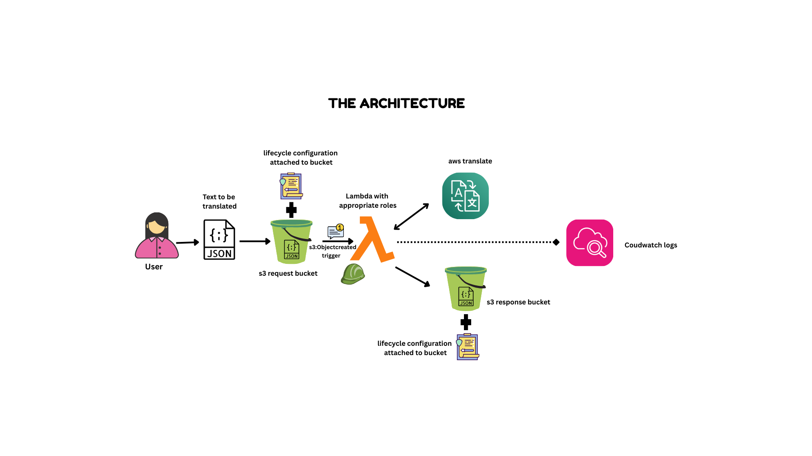

# Capstone Project: Serverless Translation with AWS

This project builds a serverless translation pipeline using **Amazon S3**, **AWS Lambda**, and **Amazon Translate**.

- Users upload a JSON file into a **request S3 bucket**.
- An S3 **event notification** triggers a Lambda function.
- The Lambda uses **Amazon Translate** to translate the text(s).
- The results are written into a **response S3 bucket** as a JSON file.

Everything is provisioned with **Terraform**.

---

## 🛠️ Prerequisites

- Terraform (>= 1.5)
- AWS CLI
- AWS account + IAM user/role with permissions to create S3, Lambda, IAM, and Translate
- Python 3.13 (for Lambda runtime)
- PowerShell (for packaging Lambda on Windows)

---

## 🛠️ Architecture

1. **S3 Request Bucket** – receives input JSON files.
2. **S3 Event** – triggers Lambda whenever a `.json` file is uploaded.
3. **Lambda Function** – downloads the input, translates it, uploads the result.
4. **S3 Response Bucket** – stores translated results.
5. **IAM Role + Policy** – grants Lambda access to S3, Translate, and CloudWatch Logs.



---

## 📂 Project Structure

```text
capstone-aws-translate/
├─ assets/
│  ├─ aws_translate_architecture.png
├─ infrastructure/
│  ├─ main.tf
│  ├─ variables.tf
│  └─ outputs.tf
│  └─ terraform.tfvars.example
├─ lambda/
│  └─ handler.py
│  └─ requirements.txt
├─ samples/
│  ├─ input_single.json
│  ├─ input_multi.json
│  └─ input_multi_lang.json
└─ README.md
```

---

## 🚀 Getting Started (Quick Run)

> **⚠️ Important Safety Notes**
>
> 1. Bucket names must be globally unique, Always edit `terraform.tfvars` before deploying.
> 2. Use the included template `terraform.tfvars.example` and do not commit your real `terraform.tfvars` to Github.
> 3. Follow steps in order to avoid deployment issues.

1. Clone the repo:

   ```bash
   git clone https://github.com/Genius-Genie/capstone-aws-translate.git
   cd capstone-aws-translate/infrastructure
   ```

2. Create and configure terraform.tfvars:

   Create a `terraform.tfvars` file and set **unique bucket names**. Edit `terraform.tfvars` to set unique bucket names. Replace `<yourname>` with a unique identifier

   ```bash
   cp terraform.tfvars.example terraform.tfvars
   ```

   ```hcl
   request_bucket_name  = "capstone-request-yourname-2025"
   response_bucket_name = "capstone-response-yourname-2025"
   ```

3. Deploy the infrastructure:

   ```bash
   terraform init
   terraform validate
   terraform plan
   terraform apply -auto-approve
   ```

4. Package and deploy the Lambda:

   ```bash
   cd ../lambda
   zip -r ../lambda_package.zip *
   cd ../infrastructure
   terraform apply -auto-approve
   ```

5. Upload a sample input:

   ```bash
   aws s3 cp ../samples/input_single.json s3://capstone-request-yourname-2025/
   ```

6. Check the response bucket for a file starting with `translated_`:

   ```bash
   aws s3 ls s3://capstone-response-yourname-2025/
   ```

---

## 📄 Input Format

The input JSON must include:

- `SourceLanguage`: ISO code of the source language (e.g., `"en"`).
- `TargetLanguages`: list of one or more target language codes.
- `Texts`: either a single string or a list of strings.

### Example 1: Single text

```json
{
  "SourceLanguage": "en",
  "TargetLanguages": ["es"],
  "Texts": "Hello world"
}
```

### Example 2: Multiple texts

```json
{
  "SourceLanguage": "en",
  "TargetLanguages": ["fr"],
  "Texts": ["Good morning", "How are you?"]
}
```

### Example 3: Multiple texts, multiple languages

```json
{
  "SourceLanguage": "en",
  "TargetLanguages": ["de", "es"],
  "Texts": ["Good night", "See you tomorrow"]
}
```

---

## ⚡ Deployment Steps

### 1. Configure AWS CLI

```bash
aws configure
```

### 2. Package Lambda code

```bash
cd lambda
zip -r ../lambda_package.zip *
cd ..
```

### 3. Deploy with Terraform

```bash
cd infrastructure
terraform init
terraform validate
terraform plan
terraform apply -auto-approve
```

> **⚠️ Note:** Bucket names are defined in `terraform.tfvars`.
> S3 bucket names must be globally unique, so edit that file before running `terraform apply`.

### 4. Upload a sample file

```bash
aws s3 cp ../samples/input_single.json s3://capstone-request-yourname-2025/
```

### 5. Check logs (optional)

```bash
aws logs tail /aws/lambda/capstone_translate_lambda --follow
```

### 6. Destroy resources (cleanup)

```bash
terraform destroy -auto-approve
```

---

## 🧪 Testing with Sample Files

Three sample inputs are included in the `samples/` folder:

- `input_single.json` – single text, one target language
- `input_multi.json` – multiple texts, one language
- `input_multi_lang.json` – multiple texts, multiple languages

Upload them to the request bucket to trigger Lambda:

```powershell
aws s3 cp ..\samples\input_single.json s3://<your-request-bucket>/
aws s3 cp ..\samples\input_multi.json s3://<your-request-bucket>/
aws s3 cp ..\samples\input_multi_lang.json s3://<your-request-bucket>/
```

Check the response bucket for files prefixed with `translated_`.

---

## 🔒 Safety Features

- Lifecycle rules: objects in both buckets expire automatically after 30 days.
- Least-privilege IAM: Lambda can only read from the request bucket, write to the response bucket, call `translate:TranslateText`, and write logs.
- Manual cleanup: Always run `terraform destroy` to avoid costs.

---

## 📜 Notes

- The Lambda supports both **single string** and **list of strings** in `Texts`.
- Multiple target languages can be provided in one request.
- If the input JSON is malformed, Lambda logs a clear error to **CloudWatch Logs**.
- Amazon Translate may call Amazon Comprehend if you set `SourceLanguage` to `"auto"` (this can incur extra charges and requires the region to support Comprehend).

---

## 🎯 Project Goal / Summary

By the end of this project, you will have:

- Deployed a **fully serverless translation pipeline** using AWS managed services.
- Implemented **IaC with Terraform** for repeatable, consistent deployments.
- Automated translations from input JSON files to multiple target languages.
- Configured **lifecycle policies** to manage storage cost.

This project demonstrates the ability to design, implement, and manage a real-world cloud-native application — showcasing **cloud architecture skills, automation, and serverless design principles**.
